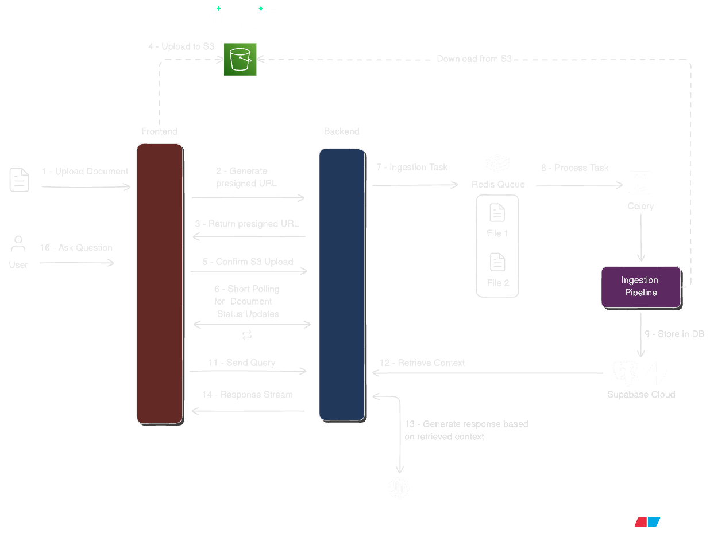

# [KnowledgeDock](https://production-rag-client.vercel.app/)

KnowledgeDock is a project-scoped knowledge assistant. Users create projects, add documents or URLs, and ask questions against that project knowledge. The system ingests content in the background, retrieves relevant context, and returns grounded answers with citations through a chat interface.

## Core Capabilities

- Project-based workspaces
  - Each project has its own documents, chats, and retrieval settings.
  - Data access is scoped by user and project ownership.

- Document and URL ingestion pipeline
  - Files are uploaded through presigned URLs and processed asynchronously.
  - Sources go through partitioning, chunking, summarization, and vectorization.

- Real-time chat with citations
  - Responses stream via SSE for fast, interactive UX.
  - Assistant messages include citations, keeping every answer grounded in the source material.

- Configurable retrieval and agent behavior
  - Retrieval can be tuned per project (vector, hybrid, multi-query variants).
  - Agent behavior supports simple and supervisor patterns.

- Production-oriented architecture
  - API and background workers are separated for independent scaling.
  - Redis + Celery queue heavy ingestion work off the server, so it can remain responsive.
  - Metadata and chunks live in PostgreSQL (Supabase) with pgvector for retrieval.
  - Raw files are stored in S3-compatible object storage.

- Security and observability
  - Clerk-based JWT authentication with resource-level ownership checks.
  - Structured logging for ingestion, retrieval, and chat flows.

## Tech Stack

### Frontend

- Next.js
- TypeScript
- Tailwind CSS
- Clerk (Auth)

### Backend

- FastAPI
- Python
- Supabase PostgreSQL
- Tigris Data (S3 compatible object storage)
- Redis
- Celery

### AI / ML Stack

- LangChain
- LangGraph
- LangSmith
- Unstructured.io

### Deployment

- Docker
- AWS

## High Level Overview

### Ingestion

1. The user uploads a document or adds a website URL from the project dashboard.
2. The backend generates a presigned S3 upload URL for document files.
3. The backend returns that URL to the client.
4. The client uploads the file directly to S3.
5. The client confirms the S3 upload with the backend, and the document is queued for ingestion.
6. While ingestion runs, the frontend uses short polling for document processing status updates.
7. The Celery worker starts the ingestion task by downloading the file or scraping the URL.
8. The ingestion pipeline partitions the content, chunks it by title, optionally summarizes multimodal chunks, and generates embeddings.
9. The resulting chunks and metadata are stored in Supabase, and the document status is updated until processing completes.

### Retrieval

10. The user asks a question from the chat interface.
11. The query is sent to the server.
12. The server loads the agent type and retrieval settings, then retrieves the project context and injects it into the prompt.
13. The model generates the answer.
14. The response is streamed back to the user with SSE.

## Documentation Flow

Choose the path that matches what you want to understand:

1. [Database Design](documentation/DATABASE.md) if you want the schema, retrieval tables, and ownership model.
2. [API Endpoints](documentation/API_ENDPOINTS.md) if you want the available routes and runtime flows.
3. [Ingestion Pipeline](documentation/INGESTION_PIPELINE.md) if you want the document and URL processing flow.

## Related Docs

- [API Endpoints](documentation/API_ENDPOINTS.md)
- [Database Design](documentation/DATABASE.md)
- [Ingestion Pipeline](documentation/INGESTION_PIPELINE.md)
- [Retrieval Pipeline](documentation/RETRIEVAL_PIPELINE.md)
- [Generation Pipeline](documentation/GENERATION_PIPELINE.md)
