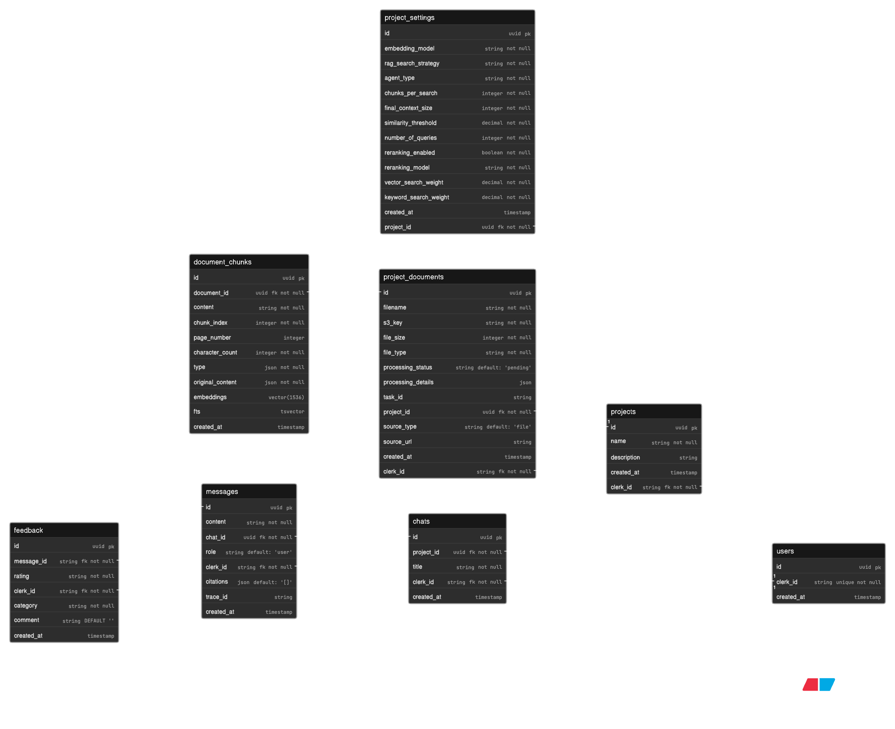

# Database Design

## Overview

KnowledgeDock uses **Supabase PostgreSQL** with **pgvector** for vector embeddings and **full-text search (FTS)** for keyword retrieval. The schema is shaped around user and project ownership, not a one-size-fits-all document store.

## Core Data Model



## Tables

### users

- `clerk_id` (unique, indexed): Clerk JWT identifier, root for all user data
- Minimal footprint; auth is delegated to Clerk

### projects

- `id`, `name`, `description`, `clerk_id`
- One namespace per project; documents and chats are isolated by project

### project_settings

Stores **per-project retrieval tuning**:

- `rag_strategy`: "basic", "hybrid", "multi-query-vector", "multi-query-hybrid"
- `embedding_model`: Which embedding model to use
- `chunks_per_search`: How many chunks to retrieve before reranking
- `final_context_size`: How many chunks to include in the final prompt
- `similarity_threshold`: Cutoff for vector similarity
- `reranking_enabled`, `reranking_model`: Project-level reranking controls
- `vector_weight`, `keyword_weight`: Weights for hybrid search

> [!NOTE]
> These are project-level settings (not user-level), so each project can tune retrieval for its own use case.

### project_documents

- Tracks ingestion progress with `processing_status`: uploading → queued → processing → partitioning → chunking → summarising → vectorization → completed
- `processing_details`: JSON accumulates step-by-step progress (e.g., `{partitioning: {elements_found: {text: 159, tables: 4, images: 7}}, chunking: {total_chunks: 25}}`)
- `task_id`: UUID generated by Celery when the task is queued; differs from `document_id` (DB row) to enable independent job tracking
- `source_type`: "file" (S3) or "url" (web scrape)

### document_chunks

Core retrieval table: stores chunked content + embeddings

- `content`: Text chunk (or summary if chunk contains images/tables)
- `embedding`: pgvector(1536) for semantic search via OpenAI embeddings
- `fts`: Auto-generated, indexed column for full-text search (no extra pipeline needed)
- `original_content`: JSON with text, images (base64), and tables (HTML)
- `type`: JSON array of content types (e.g., `["text", "table", "image"]`)
- `page_number`, `chunk_index`: Preserve document structure for citations

### chats

Represents individual conversation threads within a project

- `id`, `project_id`, `clerk_id`, `created_at`
- Multiple chats per project; isolated namespaces for different conversations

### messages

Individual messages within a chat

- `role`: "user" or "assistant"
- `content`: Message text
- `trace_id`: Optional tracing identifier for observability/debugging
- `citations`: JSON array of source chunk IDs and metadata. Since they are stored with the message and not a separate table, they stay bound to the response they support

### feedback

Stores user feedback on assistant messages so response quality can be reviewed and improved over time.

- `rating`: "like" or "dislike"
- `category`: Categorization of feedback (e.g., "inaccurate", "irrelevant", "helpful")
- `comment`: Optional free-form comment

## PostgreSQL Retrieval Functions

### Vector Search (pgvector)

```sql
SELECT * FROM document_chunks
WHERE document_id = ANY(filter_document_ids)
  AND (1 - (embedding <=> query_embedding)) > match_threshold
ORDER BY embedding <=> query_embedding ASC
LIMIT chunks_per_search;
```

- Only include chunks from the specified documents (only the documents that belong to the project)
- Uses **cosine distance** (`<=>` operator) to calculate cosine similarity (1 - cosine distance)
- HNSW index for fast approximate nearest neighbor search
- `similarity_threshold` from project settings filters weak matches

> [!NOTE]
> Since OpenAI embeddings are normalized, Euclidean distance = Cosine distance

### Keyword Search (FTS)

- Vector search is strong at semantic matching, but it can miss exact terms, jargon, or product names when the wording is specific.
- Keyword search is useful when the user already knows the exact phrase, acronym, or technical term they want to find.
- It is less flexible than vector search, but it is very reliable for literal matches.

```sql
SELECT * FROM document_chunks
WHERE fts @@ websearch_to_tsquery('english', query_text)
  AND document_id = ANY(filter_document_ids)
ORDER BY ts_rank_cd(fts, query_text) DESC
LIMIT chunks_per_search;
```

- Only include chunks from the specified documents (only the documents that belong to the project)
- `fts` column is auto-generated from `content` using English stemming
- GIN index for fast FTS lookups

## Indexing

Indexing speeds up retrieval by maintaining a compact lookup structure that points to matching rows.

- Without indexes, PostgreSQL performs full table scans.
- With indexes, it can jump directly to candidate rows.
- Think of it like using a book index instead of reading every page to find one topic.

### Generalized Inverted Index (GIN)

- Used for text search on the `fts` column.
- Splits content into terms and maps each term to the rows where it appears.
- At query time, PostgreSQL intersects term match lists instead of scanning full text.
- Example: searching `error budget` quickly finds rows containing both terms.

### Hierarchical Navigable Small World (HNSW)

- Used for vector similarity search on embeddings.
- Embeddings encode meaning, so lookup is nearest-neighbor search, not exact token matching.
- HNSW organizes vectors as a layered graph to make approximate nearest-neighbor retrieval fast.
- Search starts from coarse links, then navigates toward denser local neighborhoods.
- This gives low-latency semantic retrieval without comparing against every row.

## Ownership & Security

Every major query scopes by `clerk_id`. This ensures users can only see their own projects and chats.

```sql
SELECT * FROM ....
WHERE clerk_id = ...  -- Always filter by user
```

Documents that do not belong to the current project are filtered out; no cross-project data leakage.

## Related Docs

- [Server README](../README.md)
- [API Endpoints](API_ENDPOINTS.md)
- [Ingestion Pipeline](INGESTION_PIPELINE.md)
- [Retrieval Pipeline](RETRIEVAL_PIPELINE.md)
- [Generation Pipeline](GENERATION_PIPELINE.md)
