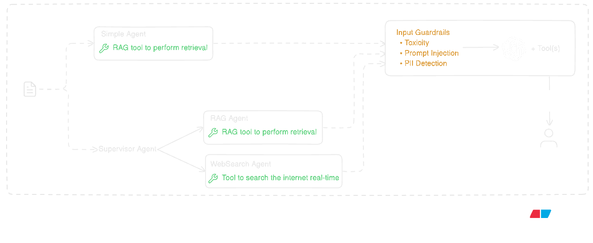
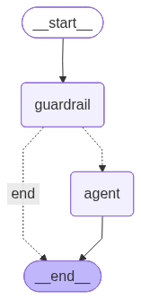
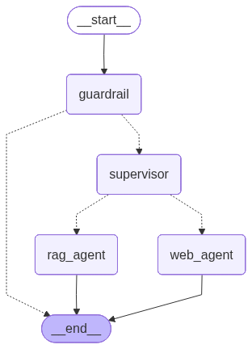

# Generation Pipeline

## Overview

The generation pipeline converts a user message into a grounded assistant response with citations. It handles agent orchestration, safety checks, tool routing (RAG and/or web), prompt assembly, response generation, streaming, and persistence.

## End-to-End Flow

1. Project settings are loaded and `agent_type` is selected.
2. Recent chat history is loaded for context.
3. The selected agent is invoked (`simple` or `agentic`).
4. Guardrails evaluate input safety before answer generation.
5. The agent decides whether to call `rag_search`, `search_web`, or both.
6. Called tools return grounded context and, for RAG, citations.
7. The model synthesizes tool outputs into the final response.
8. Response stream is returned as SSE events.

## Agent Modes

### 1. Simple agent

How it works:

- The simple agent is implemented as a single-agent LangGraph flow with one primary tool, `rag_search`.
- The user message first passes through a guardrail node (`check_input_guardrails`) that evaluates toxicity, prompt injection patterns, and potential PII leakage.
  - If the guardrail fails, generation is stopped and a rejection response is returned.
  - If it passes, the agent executes `rag_search`, retrieves project-grounded context (text, images, tables, citations), and generates the final answer from that retrieved evidence.

Key behavior:

- prompt enforces RAG-first answering behavior
- optional chat history is injected into system prompt context
- custom agent state accumulates citations across tool calls
- state also tracks a `guardrail_passed` flag used for conditional routing
- base agent is configured with a recursion limit to cap repeated tool-call cycles and prevent runaway execution
- responses are constrained to project document evidence

This flow works well for document-grounded Q&A within a project because it keeps the response tied to retrieved evidence and preserves a predictable RAG-first path.

### 2. Supervisor agent

How it works:

- The supervisor mode is a multi-agent orchestration pattern.
- The same guardrail stage runs first; if safe, the supervisor routes the query to one or both specialist tools based on intent:
  - `rag_search` for project-internal documents (wrapped RAG sub-agent)
  - `search_web` for external/current information (wrapped web sub-agent)
- The supervisor then synthesizes tool outputs into a single response while preserving citations from the RAG path.

Key behavior:

- tool routing is intent-driven rather than hardcoded per endpoint
- RAG is prioritized for project-specific questions
- web search is used for external/current information requests, with Tavily preferred when API key is present and a DuckDuckGo fallback otherwise
- chat history is available for follow-up continuity and reference resolution
- supervisor prompt allows direct reply only for low-risk conversational turns (greetings/acknowledgments/farewells); factual requests must use tools
- wrapped tool design keeps specialized agent internals modular while exposing stable supervisor tool interfaces

This flow is a good fit for mixed queries because it can use project documents, web search, or both depending on what the user is asking.

## Guardrails

Before the agent execution, an LLM-as-judge guardrail checks the latest user message for:

- toxicity/harmful intent
- prompt-injection patterns
- potential PII exposure

Guardrail output schema:

- `is_toxic`
- `is_prompt_injection`
- `contains_pii`
- `is_safe`
- `reason`

If guardrail fails, generation is stopped and a rejection response is returned. If guardrail passes, agent execution continues.

## Prompt Construction and Response Generation

How it works:

- After retrieval, context is assembled into a structured prompt with clear constraints:
  - answer only from provided context
  - avoid unsupported assumptions
  - return insufficiency message when evidence is missing
- Context includes:
  - text chunks
  - related tables as HTML
  - related images (base64 image inputs in multimodal message)
- When chat history is provided, recent turns are formatted and appended to the system prompt. This enables pronoun/reference resolution in follow-up questions.
- The model then generates the final answer from this grounded context.

## Streaming Path (SSE)

The streaming endpoint sends progressive events so the UI can render status and tokens in real time.

Event types:

- `status`: phase updates (thinking, searching, generating)
- `token`: incremental output tokens
- `done`: final persisted user/assistant payload
- `error`: terminal failure signal

This keeps the chat experience responsive, reduces perceived latency, and makes agent progress visible while the response is being generated.

## Failure Handling

Common failure points are handled with explicit errors:

- user message persistence failure
- settings lookup failure (fallback to default agent mode)
- generation/tool execution failure
- assistant message persistence failure

Failures are emitted through `error` events.

Within agent execution, tool-level exceptions are converted into structured tool messages so the model can return a clear failure explanation instead of silently failing.

## Related Docs

- [Server README](../README.md)
- [API Endpoints](API_ENDPOINTS.md)
- [Ingestion Pipeline](INGESTION_PIPELINE.md)
- [Retrieval Pipeline](RETRIEVAL_PIPELINE.md)
- [Database Design](DATABASE.md)
