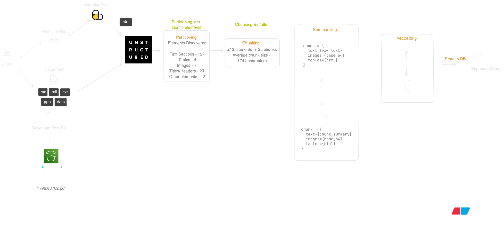

# Ingestion Pipeline

## Overview

Uploaded files and URLs are transformed into searchable chunks and embeddings by the ingestion pipeline. Execution is performed asynchronously so the server remains responsive while heavier ingestion work is handled by Celery workers.

## End-to-End Flow



1. A worker dequeues the document and starts ingestion. (Document status - `processing`)
2. If the source is a file, it is downloaded from S3; if the source is a URL, it is crawled and scraped. (Document status - `partitioning`)
3. The source is partitioned into atomic elements. (Document status - `chunking`)
4. Extracted elements are grouped into chunks. (Document status - `summarising`)
5. For multimodal chunks (tables/images), searchable summaries are generated; for plain-text chunks, original text is retained. (Document status - `vectorization`)
6. Embeddings are generated and stored in `document_chunks` with metadata, and ingestion is marked complete. (Document status - `completed`)

## Pipeline Stages

### 1. Source acquisition

- If a document has been uploaded, it is downloaded from S3. Supported file types include `.pdf`, `.docx`, `.pptx`, `.md`, and `.txt`.
- URLs are crawled and converted into HTML.

### 2. Partitioning

- Unstructured.io is used to extract elements from PDFs, DOCX, PPTX, Markdown, plain text, and HTML.
- The mix of text, tables, images, titles, and other elements is tracked in `processing_details`. For example:

```
"partitioning": {
    "elements_found": {
      "text": 159,
      "tables": 4,
      "images": 7,
      "titles": 29,
      "other": 13
    }
}
```

- The same downstream path is followed by both URL and file sources after partitioning.

### 3. Chunking

- Elements are grouped with `chunk_by_title`.
- Chunks are capped at roughly 3000 characters, with a target break point around 2400 characters.
- Chunk size is kept large enough for context while remaining retrieval-friendly.
- The following JSON is added to `processing_details`.

```
"chunking": {
    "total_chunks": 25
}
```

### 4. Summarization

- For chunks containing tables or images, a searchable summary is generated by the LLM.
- Original text, tables, and images are preserved in `original_content`.
- A structured search index (questions + keywords + visual/data signals) is generated so retrieval quality improves.
- The following JSON is added to `processing_details`.

```
"summarising": {
    "current_chunk": 25,
    "total_chunks": 25
}
```

### 5. Vectorization and storage

- Each final chunk is embedded with the configured embedding model.
- Chunk text, metadata, embeddings, and structure fields are inserted into `document_chunks`.
- The stored record is what the retrieval layer later searches.

## Status Tracking

`project_documents.processing_status` is updated throughout the run so short polling in the UI can show real-time progress.

- `uploading` - the document row is created and a presigned upload flow is in progress.
- `pending` - reserved transitional state for the UI.
- `queued` - upload has been confirmed (or a URL has been inserted), and the Celery task has been queued.
- `processing` - the worker has started the task and the ingestion pipeline has begun.
- `partitioning` - the content is being broken down into atomic elements.
- `chunking` - extracted elements are being grouped into chunks.
- `summarising` - multimodal chunks are being converted into searchable text summaries.
- `vectorization` - embeddings are being generated and chunk records are being stored.
- `completed` - all chunk records have been stored successfully and ingestion has finished.

## Related Docs

- [Server README](../README.md)
- [API Endpoints](API_ENDPOINTS.md)
- [Database Design](DATABASE.md)
- [Retrieval Pipeline](RETRIEVAL_PIPELINE.md)
- [Generation Pipeline](GENERATION_PIPELINE.md)
