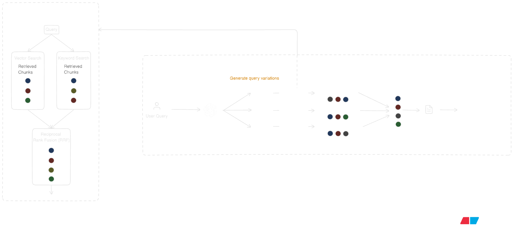

# Retrieval Pipeline

## Overview

The retrieval pipeline transforms a user question into grounded project context for answer generation. Candidate chunks are retrieved from project documents, ranked according to project retrieval settings, and assembled as text, image, table, and citation payloads.

Because retrieval is project-configurable, the same corpus can be searched with different strategies depending on recall, precision, and latency goals.

## End-to-End Flow

1. A user question is received by the chat layer.
2. Retrieval settings are loaded from `project_settings`.
3. Project document IDs are fetched from `project_documents`.
4. The configured retrieval strategy is executed.
5. Retrieved candidates are merged/ranked and then truncated to `final_context_size`.
6. Final chunks are split into text, images, tables, and citations.
7. The assembled context is passed to the generation pipeline.

> [!NOTE]
> This flow represents the RAG branch (`rag_search`) after the agent decides to use retrieval. In supervisor mode, the agent may choose web search instead (or combine both) depending on intent.

## Retrieval Inputs

### Project settings

Retrieval behavior is controlled by `project_settings`.

- `embedding_model`: embedding model used for query embedding in vector search. Default: `text-embedding-3-large`.
- `rag_strategy`: retrieval strategy. Supported values: `basic`, `hybrid`, `multi-query-vector`, `multi-query-hybrid`. Default: `basic`.
- `agent_type`: answer-generation agent mode (`simple` or `agentic`). Default: `agentic`.
- `chunks_per_search`: number of chunks returned by each retrieval call. Default: `10`.
- `final_context_size`: maximum number of chunks passed to generation. Default: `5`.
- `similarity_threshold`: vector similarity filter threshold. Default: `0.3`.
- `number_of_queries`: number of query variants for multi-query strategies. Default: `5`.
- `reranking_enabled`: project-level toggle for reranking behavior.
- `reranking_model`: configured reranker model identifier.
- `vector_weight`: weight for vector results in hybrid search. Default: `0.7`.
- `keyword_weight`: weight for keyword results in hybrid search. Default: `0.3`.

Note: retrieval is strictly project-scoped. Only documents belonging to the active project are searched.

## Search Strategies

### 1. Basic vector search

How it works:

The query is represented in embedding space and matched against chunk embeddings by semantic proximity. Retrieval is driven by meaning similarity rather than exact token overlap.

Best for:

- questions are phrased clearly
- corpora where user wording is generally aligned with document wording
- low-latency baseline retrieval with minimal strategy complexity

Example:

- A user asks: "What are the onboarding steps?"
- Relevant chunks are found even if the document says "new employee setup process".

### 2. Hybrid search

How it works:

Two independent retrieval signals are generated and fused into a single ranking:

- semantic matching (meaning-based)
- keyword matching (exact terms)

Best for:

- exact terms matter (product codes, legal clauses, policy IDs, metric names)
- mixed-query patterns where natural language intent and strict identifiers appear together
- high-precision retrieval in domain-heavy corpora

Example:

- User asks: "What is the SLA for P1 incidents in policy DOC-442?"
- Semantic search finds incident-response sections.
- Keyword search ensures chunks containing `P1`, `SLA`, and `DOC-442` are not missed.
- Both signals are combined, so top results are both relevant and term-accurate.

### 3. Multi-query vector search

How it works:

The original query is expanded into multiple semantically equivalent variants. Each variant is retrieved independently with vector search, and the ranked outputs are fused.

Best for:

- the question is vague, short, or underspecified
- terminology mismatch between user language and document language
- recall-oriented retrieval where broader coverage is preferred over minimal compute

Example:

- Original question: "Why did costs go up?"
- Variations may target phrasing like "expense increase drivers", "cost overrun causes", or "budget variance reasons".
- This reduces dependence on one wording and improves the chance of finding the right evidence.

### 4. Multi-query hybrid search

How it works:

Query variations are generated first. For each variation, hybrid retrieval is applied (semantic + keyword), and all ranked lists are fused into a final candidate set.

Best for:

- questions are complex and phrasing is uncertain
- compliance, audit, and policy workflows where recall and term precision are both critical
- difficult queries where single-pass retrieval is likely to miss key evidence

Example:

- Question: "What changed in compliance requirements for EU customer data last quarter?"
- Multiple rewrites broaden intent coverage.
- Hybrid retrieval keeps strict terms like `EU` and `compliance` in play.
- This is usually the highest-recall strategy for difficult enterprise queries.

## Reciprocal Rank Fusion (RRF)

RRF combines multiple ranked lists into one ranking by accumulating a reciprocal score for each chunk.

The weighted RRF score for chunk $d$ is:

$$
	score(d)=\sum_{i=1}^{m} w_i\cdot\frac{1}{k+\text{rank}_i(d)}
$$

Where:

- $m$ is the number of ranked lists
- $w_i$ is the weight of list $i$ (equal by default, or configured in hybrid search)
- $\text{rank}_i(d)$ is the 1-based rank of chunk $d$ in list $i$
- $k$ is a damping constant (set to `60`)

Why not use $k=0$:

- $\text{rank}_1$ gets $1.0$, $\text{rank}_2$ gets $0.5$, $\text{rank}_3$ gets $0.33$
- this creates a very steep penalty between adjacent ranks, and small differences in similarity scores often do not reflect meaningful relevance differences.

Using $k=60$ is the industry standard[^1]. It prevents items ranked at the very top from carrying a disproportionately high weight compared to those slightly below them.
[^1]: Popularized by this [paper](https://cormack.uwaterloo.ca/cormacksigir09-rrf.pdf) by Cormack et al.

## Reranking

Reranking is a precision layer applied after candidate retrieval. In practice, retrieval quality is improved by treating search as a two-stage system:

- In Stage 1, retrieval methods are used to maximize recall and produce a candidate set.
- In Stage 2, a reranker (typically a cross-encoder) scores each candidate by jointly encoding the query and chunk, then reorders the list by direct relevance.

This addresses a core limitation of embedding-only retrieval:
the model never sees the query and the chunk together during the search. Joint query-chunk scoring provides finer discrimination, especially among top candidates that are all "somewhat relevant."

### Why this two-stage pattern is used:

**Stage 1: Embeddings (Fast and Inexpensive)**

- Embeddings are used to retrieve a candidate neighborhood quickly across a large corpus.
- This stage is computationally efficient and scalable, so it is ideal for narrowing millions of chunks to a manageable shortlist.
- However, embedding similarity is an approximation. Query and chunk are compared as separate vectors, so semantically related but non-answer passages can still appear near the top.
- Retrieval is fast, scalable, and inexpensive for large corpora.

**Stage 2: Reranker**

- Reranking is more computationally expensive, but applied only to a small candidate set.
- A reranker (typically a cross-encoder) evaluates query and chunk together and assigns a direct relevance score.
- This is where near-ties from stage one are resolved and answer-bearing chunks are promoted.

> [!NOTE]
> A useful mental model is recall first, precision second. Stage 1 casts a wide and inexpensive net; Stage 2 performs deeper comparison on a small candidate set.

## Context Assembly

After ranking, the candidate list is truncated to `final_context_size`. Selected chunks are then separated into:

- text content
- image payloads
- table payloads
- citations

Context is assembled from `original_content` so source information is preserved. Summarized chunk text is primarily used for retrieval matching, while original text/tables/images are retained for grounded generation.

Each citation includes:

- `chunk_id`
- `document_id`
- `filename`
- `page`

This allows generated answers to be traced back to the original sources.

## Related Docs

- [Server README](../README.md)
- [API Endpoints](API_ENDPOINTS.md)
- [Database Design](DATABASE.md)
- [Ingestion Pipeline](INGESTION_PIPELINE.md)
- [Generation Pipeline](GENERATION_PIPELINE.md)

If you are reading this after ingestion, read [Generation Pipeline](GENERATION_PIPELINE.md) next.
